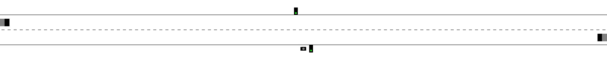

# CAV-Gym
A custom OpenAI Gym environment that supports Markov games (joint actions, joint observations, joint rewards) and simple vehicle physics.



## Usage
```
$ python3 cavgym.py --help
usage: cavgym.py [-h] [-d] [-r DIR] [-v]
               [{bus-stop,crossroads,pelican-crossing}]

positional arguments:
  {bus-stop,crossroads,pelican-crossing}
                        choose scenario to run (default: pelican-crossing)

optional arguments:
  -h, --help            show this help message and exit
  -d, --debug           print debug information
  -r DIR, --record DIR  record video of run to directory DIR
  -v, --version         show program's version number and exit
```
