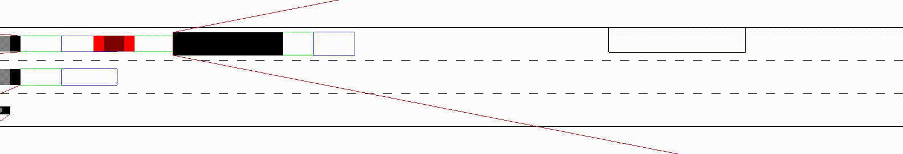
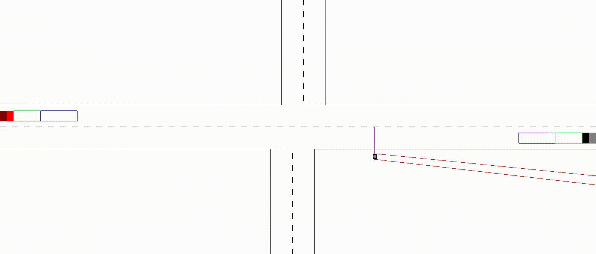
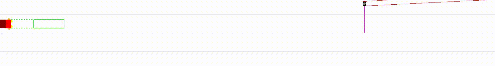
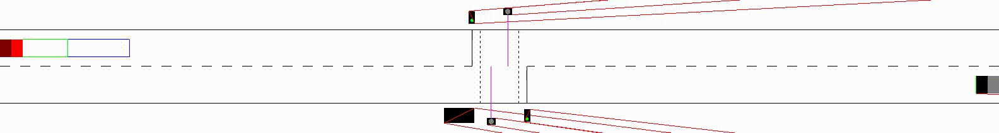

# CAV-Gym
A custom OpenAI Gym environment that supports Markov games (joint actions, joint observations, joint rewards) and simple vehicle physics.

## Scenarios

- Bus stop (seed: 17359833141626636985)

- Crossroads (seed: 8929925869146571446)

- Pedestrians (seed: 3501740327069189902)

- Pelican crossing (seed: 18444432827211628117)


## Usage
```
$ python3 cavgym.py -h                                          
usage: cavgym.py [-h] [-d] [-e N] [-s N] [-t N] [-v]
                 {bus-stop,crossroads,pedestrians,pelican-crossing}
                 {headless,render} ...

positional arguments:
  {bus-stop,crossroads,pedestrians,pelican-crossing}
                        choose scenario to run
  {headless,render}     choose mode to run scenario

optional arguments:
  -h, --help            show this help message and exit
  -d, --debug           print debug information
  -e N, --episodes N    number of episodes (default: 1)
  -s N, --seed N        enable fixed random seed
  -t N, --timesteps N   max number of timesteps per episode (default: 1000)
  -v, --version         show program's version number and exit
```

Additional options are supported in **render** mode, e.g.:
```
$ python3 cavgym.py pelican-crossing render -h
usage: cavgym.py {bus-stop,crossroads,pedestrians,pelican-crossing} render
       [-h] [-k] [-r DIR]

optional arguments:
  -h, --help            show this help message and exit
  -k, --keyboard-agent  run with keyboard-controlled agent
  -r DIR, --record DIR  save video of run to directory
```
