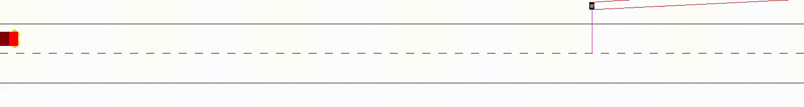

# CAV-Gym
A custom OpenAI Gym environment that supports Markov games (joint actions, joint observations, joint rewards) and simple vehicle physics.

## Scenarios

- Bus stop

- Crossroads

- Pedestrians

- Pelican crossing


## Usage
```
$ python3 cavgym.py --help                           
usage: cavgym.py [-h] [-d] [-e N] [-n | -r DIR] [-s N] [-t N] [-v]
                 [{bus-stop,crossroads,pedestrians,pelican-crossing}]

positional arguments:
  {bus-stop,crossroads,pedestrians,pelican-crossing}
                        choose scenario to run (default: pelican-crossing)

optional arguments:
  -h, --help            show this help message and exit
  -d, --debug           print debug information
  -e N, --episodes N    number of episodes (default: 1)
  -n, --no-render       run without rendering
  -r DIR, --record DIR  save video of run to directory
  -s N, --seed N        enable fixed random seed
  -t N, --timesteps N   max number of timesteps per episode (default: 1000)
  -v, --version         show program's version number and exit
```
